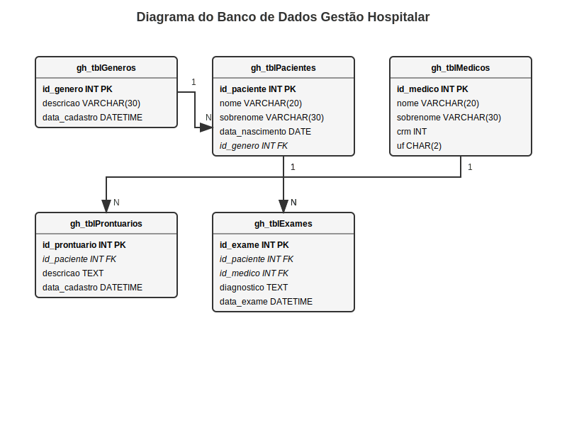

# Diagrama ER - Banco de Dados: `gestao_hospitalar`

Este diagrama ER (Entidade-Relacionamento) representa a estrutura do banco de dados **gestao_hospitalar**, com suas tabelas, campos e relacionamentos principais.

---

## 🧾 Tabelas e Campos

### **`gh_tblGeneros`**
- `id_genero` (INT, **PK**) – Chave primária
- `descricao` (VARCHAR(30)) – Descrição do gênero (ex: Masculino, Feminino)
- `data_cadastro` (DATETIME) – Data de registro

---

### **`gh_tblPacientes`**
- `id_paciente` (INT, **PK**) – Chave primária
- `nome` (VARCHAR(20)) – Nome do paciente
- `sobrenome` (VARCHAR(30)) – Sobrenome do paciente
- `data_nascimento` (DATE) – Data de nascimento
- `id_genero` (INT, **FK**) – Referência ao gênero
- `data_cadastro` (DATETIME) – Data de registro

---

### **`gh_tblMedicos`**
- `id_medico` (INT, **PK**) – Chave primária
- `nome` (VARCHAR(20)) – Nome do médico
- `sobrenome` (VARCHAR(30)) – Sobrenome do médico
- `crm` (INT) – Número do CRM
- `uf` (CHAR(2)) – Estado do CRM
- `data_cadastro` (DATETIME) – Data de registro

---

### **`gh_tblExames`**
- `id_exame` (INT, **PK**) – Chave primária
- `id_paciente` (INT, **FK**) – Referência ao paciente
- `id_medico` (INT, **FK**) – Referência ao médico
- `diagnostico` (TEXT) – Resultado do exame
- `data_exame` (DATETIME) – Data do exame
- `data_cadastro` (DATETIME) – Data de registro

---

### **`gh_tblProntuarios`**
- `id_prontuario` (INT, **PK**) – Chave primária
- `id_paciente` (INT, **FK**) – Referência ao paciente
- `descricao` (TEXT) – Anotações do prontuário
- `data_cadastro` (DATETIME) – Data de registro

---

## 🔗 Relacionamentos

- **`gh_tblGeneros`** → **`gh_tblPacientes`**:  
  Um gênero pode estar associado a **muitos pacientes** (`1:N`).

- **`gh_tblPacientes`** → **`gh_tblProntuarios`**:  
  Um paciente pode possuir **muitos prontuários** (`1:N`).

- **`gh_tblPacientes`** → **`gh_tblExames`**:  
  Um paciente pode realizar **muitos exames** (`1:N`).

- **`gh_tblMedicos`** → **`gh_tblExames`**:  
  Um médico pode realizar **muitos exames** (`1:N`).





## 📊 Visualização com Mermaid (opcional)

```mermaid
erDiagram
    gh_tblGeneros ||--o{ gh_tblPacientes : "possui"
    gh_tblPacientes ||--o{ gh_tblProntuarios : "possui"
    gh_tblPacientes ||--o{ gh_tblExames : "realiza"
    gh_tblMedicos ||--o{ gh_tblExames : "realiza"

    gh_tblGeneros {
        int id_genero PK
        varchar(30) descricao
        datetime data_cadastro
    }

    gh_tblPacientes {
        int id_paciente PK
        varchar(20) nome
        varchar(30) sobrenome
        date data_nascimento
        int id_genero FK
        datetime data_cadastro
    }

    gh_tblMedicos {
        int id_medico PK
        varchar(20) nome
        varchar(30) sobrenome
        int crm
        char(2) uf
        datetime data_cadastro
    }

    gh_tblExames {
        int id_exame PK
        int id_paciente FK
        int id_medico FK
        text diagnostico
        datetime data_exame
        datetime data_cadastro
    }

    gh_tblProntuarios {
        int id_prontuario PK
        int id_paciente FK
        text descricao
        datetime data_cadastro
    }
