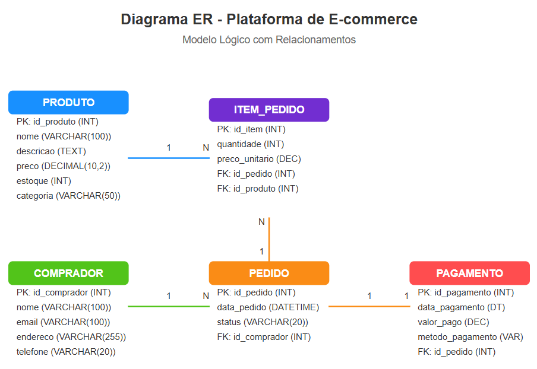
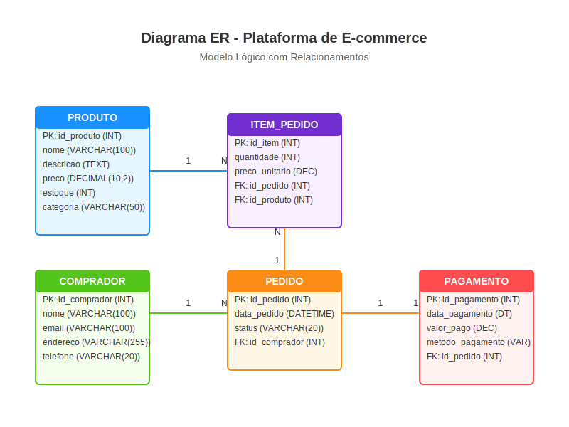

## 🛒 Plataforma de E-commerce: 

No contexto do comércio eletrônico, a modelagem conceitual é fundamental para estruturar a plataforma de e-commerce. Ao identificar as entidades relacionadas a produtos, compradores, pedidos e pagamentos, é possível garantir a integridade dos dados e a eficiência das transações realizadas na plataforma.

Estrutura de **modelo conceitual** e **modelo lógico** para uma **plataforma de e-commerce**, com base no estudo de caso fornecido.

---

## 🔷 Modelo Conceitual

No modelo conceitual, identificamos as principais **entidades**, **atributos** e os **relacionamentos** entre elas, sem nos preocupar ainda com os tipos de dados.

### Entidades e Campos:

1. **Produto**
   - ID do Produto
   - Nome
   - Descrição
   - Preço
   - Estoque
   - Categoria

2. **Comprador**
   - ID do Comprador
   - Nome
   - E-mail
   - Endereço
   - Telefone

3. **Pedido**
   - ID do Pedido
   - Data do Pedido
   - Status
   - ID do Comprador (Relacionamento com Comprador)

4. **Item do Pedido**
   - ID do Item
   - Quantidade
   - Preço Unitário
   - ID do Pedido (Relacionamento com Pedido)
   - ID do Produto (Relacionamento com Produto)

5. **Pagamento**
   - ID do Pagamento
   - Data do Pagamento
   - Valor Pago
   - Método de Pagamento
   - ID do Pedido (Relacionamento com Pedido)

---

## 🔷 Modelo Lógico

Aqui, definimos os **tipos de dados** de cada campo. A estrutura é parecida com a anterior, mas com foco técnico.

### Tabelas com tipos de dados:

1. **Produto**
   - `id_produto` (INT, PK)
   - `nome` (VARCHAR(100))
   - `descricao` (TEXT)
   - `preco` (DECIMAL(10,2))
   - `estoque` (INT)
   - `categoria` (VARCHAR(50))

2. **Comprador**
   - `id_comprador` (INT, PK)
   - `nome` (VARCHAR(100))
   - `email` (VARCHAR(100))
   - `endereco` (VARCHAR(255))
   - `telefone` (VARCHAR(20))

3. **Pedido**
   - `id_pedido` (INT, PK)
   - `data_pedido` (DATETIME)
   - `status` (VARCHAR(20))
   - `id_comprador` (INT, FK -> Comprador)

4. **Item_Pedido**
   - `id_item` (INT, PK)
   - `quantidade` (INT)
   - `preco_unitario` (DECIMAL(10,2))
   - `id_pedido` (INT, FK -> Pedido)
   - `id_produto` (INT, FK -> Produto)

5. **Pagamento**
   - `id_pagamento` (INT, PK)
   - `data_pagamento` (DATETIME)
   - `valor_pago` (DECIMAL(10,2))
   - `metodo_pagamento` (VARCHAR(50))
   - `id_pedido` (INT, FK -> Pedido)

**Por que cada campo** foi escolhido para compor o modelo lógico da base de dados da **plataforma de e-commerce**. Cada campo tem uma função clara para garantir integridade, rastreabilidade e suporte às funcionalidades do sistema. Vamos por partes:

---

### 🔹 **Tabela: Produto**

- **`id_produto` (INT, PK)**  
  Identificador único do produto. Essencial para fazer referência a produtos em outras tabelas (como `Item_Pedido`).

- **`nome` (VARCHAR(100))**  
  Nome do produto, utilizado para exibição ao usuário e em buscas.

- **`descricao` (TEXT)**  
  Detalhes adicionais sobre o produto, como características técnicas ou benefícios.

- **`preco` (DECIMAL(10,2))**  
  Representa o valor do produto, com até duas casas decimais (formato monetário).

- **`estoque` (INT)**  
  Quantidade disponível para venda. Serve para controle de inventário.

- **`categoria` (VARCHAR(50))**  
  Classificação do produto (ex: Eletrônicos, Roupas). Ajuda em filtros e organização.

---

### 🔹 **Tabela: Comprador**

- **`id_comprador` (INT, PK)**  
  Identificador único do comprador. Usado para associar pedidos.

- **`nome` (VARCHAR(100))**  
  Nome completo do cliente.

- **`email` (VARCHAR(100))**  
  Usado para login, notificações e recuperação de senha.

- **`endereco` (VARCHAR(255))**  
  Local de entrega dos produtos.

- **`telefone` (VARCHAR(20))**  
  Contato adicional para dúvidas, confirmações ou problemas na entrega.

---

### 🔹 **Tabela: Pedido**

- **`id_pedido` (INT, PK)**  
  Identificador único do pedido. Central para rastrear a transação.

- **`data_pedido` (DATETIME)**  
  Data e hora em que o pedido foi feito. Essencial para históricos e relatórios.

- **`status` (VARCHAR(20))**  
  Estado atual do pedido (Ex: Pendente, Enviado, Cancelado, Entregue).

- **`id_comprador` (INT, FK)**  
  Chave estrangeira que liga o pedido ao comprador que o realizou.

---

### 🔹 **Tabela: Item_Pedido**

- **`id_item` (INT, PK)**  
  Identificador único de cada item no pedido. Permite controlar múltiplos produtos em um mesmo pedido.

- **`quantidade` (INT)**  
  Quantos itens daquele produto foram pedidos.

- **`preco_unitario` (DECIMAL(10,2))**  
  Valor unitário do produto no momento da compra (útil para histórico de preços).

- **`id_pedido` (INT, FK)**  
  Relaciona o item a um pedido específico.

- **`id_produto` (INT, FK)**  
  Relaciona o item a um produto específico.

---

### 🔹 **Tabela: Pagamento**

- **`id_pagamento` (INT, PK)**  
  Identificador do pagamento. Permite rastrear a transação financeira.

- **`data_pagamento` (DATETIME)**  
  Quando o pagamento foi realizado.

- **`valor_pago` (DECIMAL(10,2))**  
  Total pago pelo comprador. Pode incluir frete, impostos, descontos.

- **`metodo_pagamento` (VARCHAR(50))**  
  Ex: Cartão de Crédito, Pix, Boleto. Importante para controle contábil.

- **`id_pedido` (INT, FK)**  
  Relaciona o pagamento a um pedido específico.

Esses campos são **essenciais para garantir que todas as operações da plataforma sejam rastreáveis, seguras e funcionais** — desde a exibição de produtos até a confirmação do pagamento e entrega. Se quiser, posso te mostrar como ficaria a implementação em SQL ou até montar um exemplo de consulta. Deseja seguir com isso?

---

**Diagrama ER**

 

---

 

Se desejar abrir o arquivo Use a extensão: jock.svg (SVG jock 1.977.253 (38) SVG Coding, Minify, Pretty, Preview All-In-One).

---

## 📄 Sobre o Projeto

Este projeto foi desenvolvido como parte de um estudo de caso voltado à modelagem de banco de dados para uma plataforma de e-commerce. A estrutura proposta abrange as principais entidades envolvidas em uma operação comercial online, como produtos, compradores, pedidos, itens e pagamentos, garantindo a integridade e eficiência das transações.

## 👨‍💻 Desenvolvedores

Este projeto foi idealizado e construído por:

- **Lucimara Dias**  
- **Carlos Gonçalves**  
- **Minoru Yamanaka**

